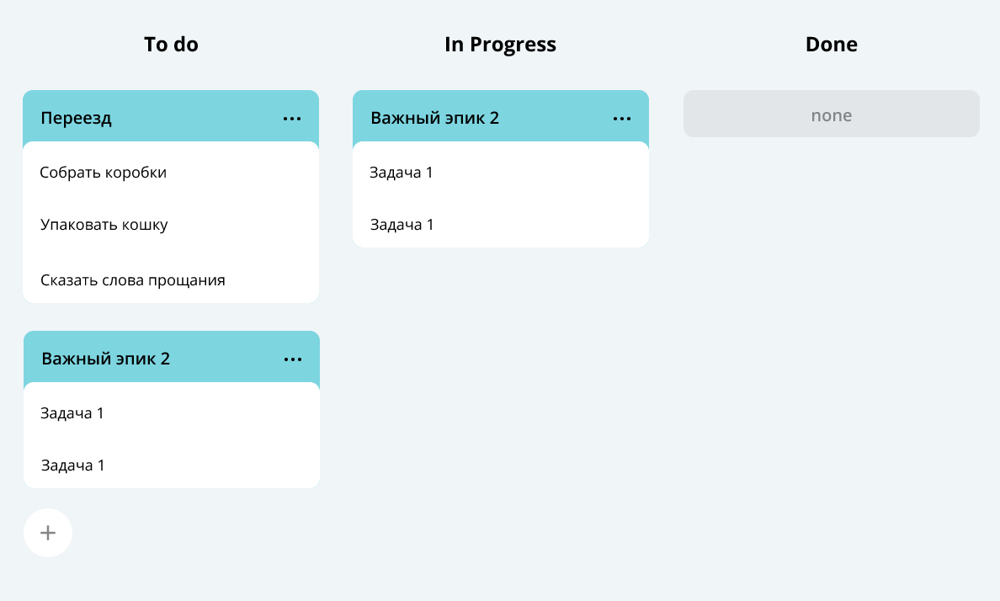

<h1 align="center">Треккер задач</h1>

## Это репозиторий проекта "Треккер задач"

### Проект еще не закончен. Впереди много работы 

#### Приложение предназначено для оформление модели данных для треккера задач.


Мое приложение **умеет**:

1.Хранить следующие типы задач:
 * Простые задачи / Эпики / Подзадачи

2.У каждого из типов задач есть следующие методы:
- Получение списка всех задач
- Удаление всех задач
- Получение задачи по идентификатору
- Созданеие новой задачи
- Обновление уже существующей задачи
- Удаление по идентификатору
- Кроме того, есть возможность получения списка подзадач для определенного эпика

3.Получение истории просмотров задач
* Возвращает историю 10 последних просмотренных задач


Приложение написано на Java. Пример кода:
```java
public class Practicum {
    public static void main(String[] args) {
        System.out.println("Меня написали на Java! (^０^)ノ");
    }
}
```
